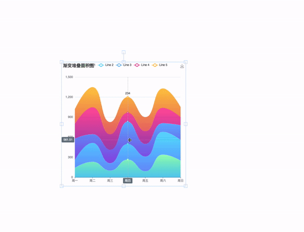

# Echarts + fabric.js = ❤️

This package allows you to include charts (using Echarts) into your fabric canvases with support for all features (e.g. events, rotation, scale, etc.).



## Installation

```
yarn add echarts-fabric
```

# Usage

You can use the regular API from both those great libraries as you would normally. Each fabric.Chart object has an extra "chart" propeprty where you can set your Echarts options (see below).

If using a custom fabric instance, please use the export "install" method.

```js
import { fabric } from 'fabric'
import { install } from 'echarts-fabric'

install(fabric)
```

Else, simply import the plugin.

```js
import fabric from 'fabric'
import 'echarts-fabric'

const instance = new fabric.Canvas('#canvas')
instance.add(new fabric.Chart({ width: 100, height: 100, chart: { ... })
```
